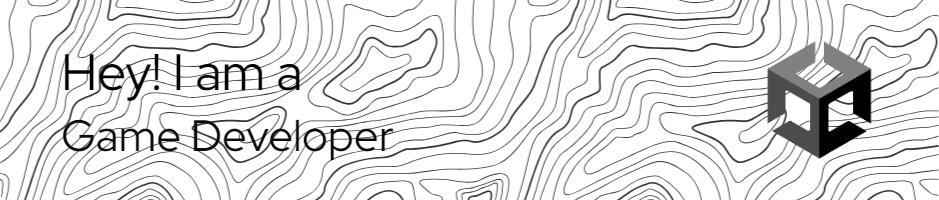

<h1 align="center">Hi 👋, I'm Bung Arvin</h1>
<h3 align="center">Hai, my name is Arian Syiddiq also known as BungArvin 🚀 Passionate on Indie Game Developer with a 3-year journey crafting immersive experiences using the Unity Game Engine. 🌐 As a tech enthusiast, I've expanded my horizons to explore the exciting worlds of backend development and cybersecurity. With an insatiable curiosity, I'm on a continuous learning path, driven to understand the intricacies of data flow, system architecture, and the art of securing digital realms.</h3>

- 🌱 I’m currently learning **Cybersecurity**

- 👯 I’m looking to collaborate on **Game Development**

- 💬 Ask me about **Game Development**

- 📫 How to reach me **arvian.syiddiq@gmail.com**

<h3 align="left">Connect with me:</h3>

<h3 align ="left">Language & Tools</h3>

  

  

  
  
&nbsp;

  
  

